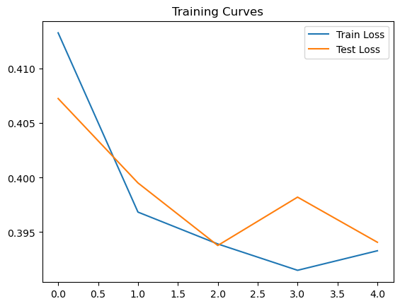

# PyTorch Spam Detection on SMS Dataset

This project implements a **Spam Detection model using PyTorch and LSTM** on the SMS Spam Collection dataset.

The model classifies SMS messages as **Spam or Ham (Not Spam)** using deep learning techniques for Natural Language Processing (NLP).

---

## Project Overview

This project demonstrates a complete NLP pipeline including:

* Text preprocessing and cleaning
* Tokenization and vocabulary construction
* Sequence encoding and padding
* LSTM-based deep learning model
* Model training and validation
* Model evaluation and prediction

---

## Dataset

Dataset used: **SMS Spam Collection Dataset**

The dataset contains thousands of SMS messages labeled as:

* **Spam**
* **Ham (Not Spam)**

The goal of the model is to correctly classify each message.

---

## Model Architecture

The deep learning architecture includes:

* Embedding Layer
* LSTM Layer
* Dropout Regularization
* Fully Connected Output Layer

The model performs **binary text classification**.

---

## Training Results

Below are the training curves for the model:



---

## Technologies Used

* Python
* PyTorch
* Pandas
* NumPy
* Scikit-learn
* Matplotlib
* Jupyter Notebook

---

## Repository Structure

```
Spam_Detection.ipynb        – training and evaluation notebook
best_spam_lstm.pth          – trained LSTM model
spam_training_curves.png    – training results visualization
requirements.txt            – required Python libraries
README.md                   – project documentation
```

---

## How to Run

Install the required libraries:

```bash
pip install -r requirements.txt
```

Then run the notebook:

```bash
jupyter notebook
```

Open:

```
Spam_Detection.ipynb
```

and execute the cells sequentially.

---

## Example Prediction

```
Message: "Congratulations! You won a free ticket."
Prediction: Spam
```

---

## Author

AI / Machine Learning enthusiast focused on NLP and Deep Learning applications.
